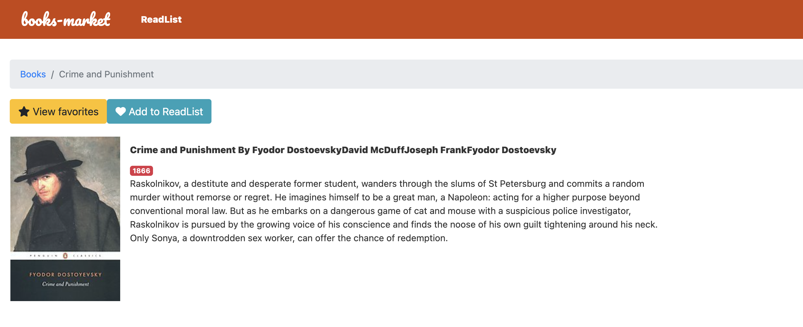
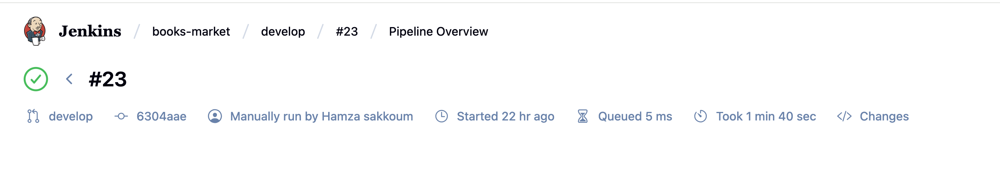

# 📚 Books market Microservice
**Books Market** Frontend is a web application built with Angular 20.
It provides a responsive and modern user interface for browsing and interacting with book data exposed by the backend microservice **"Books-store"**.

The project is tested using Jasmine/Karma and linted using Angular ESLint.
It also includes a fully automated CI/CD pipeline using Jenkins and Docker ensuring continuous integration, automated testing, and containerized deployment for a reliable and maintainable frontend application.

## 📂 Project Structure

```text
BOOKS-MARKET/
├── .angular/                # Angular CLI cache/config
├── .scannerwork/            # SonarQube analysis files
├── .vscode/                 # VSCode settings
├── dist/                    # Production build output
├── e2e/                     # End-to-end test configuration
├── node_modules/            # Project dependencies
├── public/                  # Public assets
├── src/                     # Application source code
│   ├── app/                 # Components, modules, services
│   ├── assets/              # Images, logos, styles
│   └── environments/        # Environment configs (dev/prod)
├── .editorconfig            # Editor configuration
├── .gitignore               # Git ignore rules
├── angular.json             # Angular project configuration
├── Dockerfile               # Dockerfile for production
├── Dockerfile.test          # Dockerfile for testing
├── eslint.config.js         # Angular ESLint configuration
├── Jenkinsfile              # Jenkins pipeline configuration
├── karma.conf.js            # Karma test runner configuration
├── package.json             # Angular project dependencies
├── package-lock.json        # Dependency lock file
├── README.md                # Project documentation
├── sonar-project.properties # SonarQube config
├── tsconfig.app.json        # TypeScript config (app)
├── tsconfig.json            # TypeScript base config
├── tsconfig.spec.json       # TypeScript config (tests)
└── tslint.json              # Legacy TSLint config

```
---
## 🧑🏽‍💻 Pre-requisites
- Node.js >= 20
- Angular CLI >= 20
- Docker & DockerHub account
- Jenkins for CI/CD pipeline with Docker Hub credentials set
---

## CI/CD (Jenkins + DockerHub)
1. Checkout – Pull the latest code from GitHub
2. Install Dependencies – npm install
3. Run Lint – Angular ESLint checks
4. Run Tests – Jasmine/Karma unit tests with coverage reports
5. Build Angular App 
6. Build Docker Image 
7. Push to Docker Hub – Tag & push the image
---

## 📸 Screenshots

### 🔹 /dashboard UI


### 🔹 /book UI


### 🔹 Jenkins 



## Installation
**Clone the repository:**
```bash
git clone https://github.com/sakkoumhamza/books-market-microservice.git
cd books-market-microservice
```
**Install dependencies**
```bash
npm install
```
**Run the service**
```bash
ng serve
```

---
## 🐳 Docker Setup

**Build the image**

```bash
docker build -t yourdockerhubusername/books-mmarket:latest .
```

 **Run the container**

```bash
docker run yourdockerhubusername/books-market:latest
```

## 🫂 Contributing
``` text
1. Fork the repository

2. Create a feature branch (git checkout -b feature/new-feature)

3. Commit your changes (git commit -m 'Add new feature')

4. Push to your branch (git push origin feature/new-feature)

5. Open a Pull Request
```
 